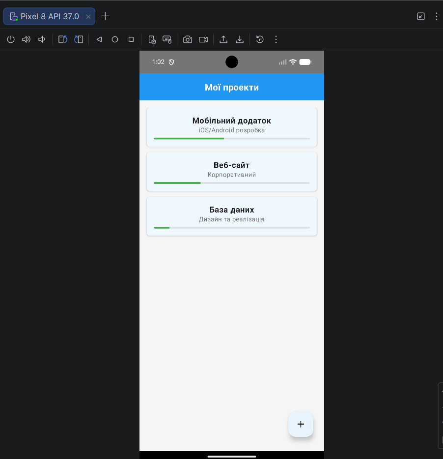
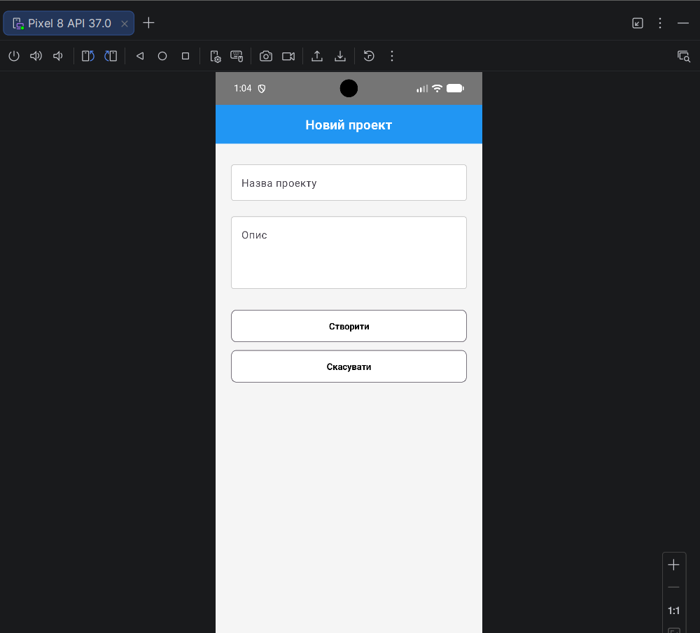
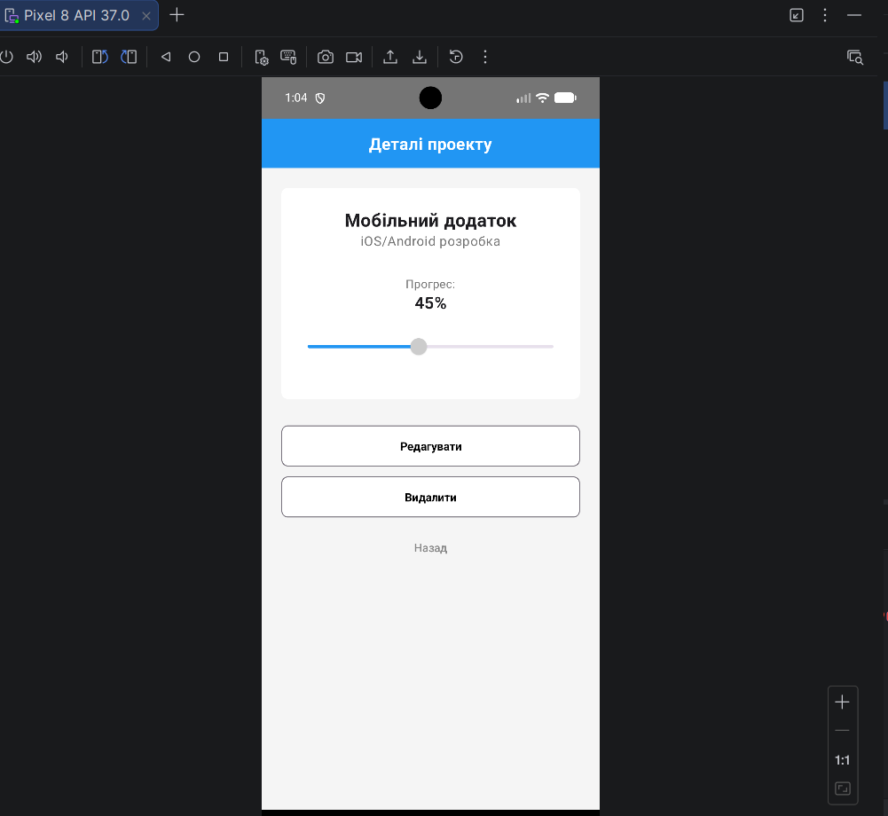
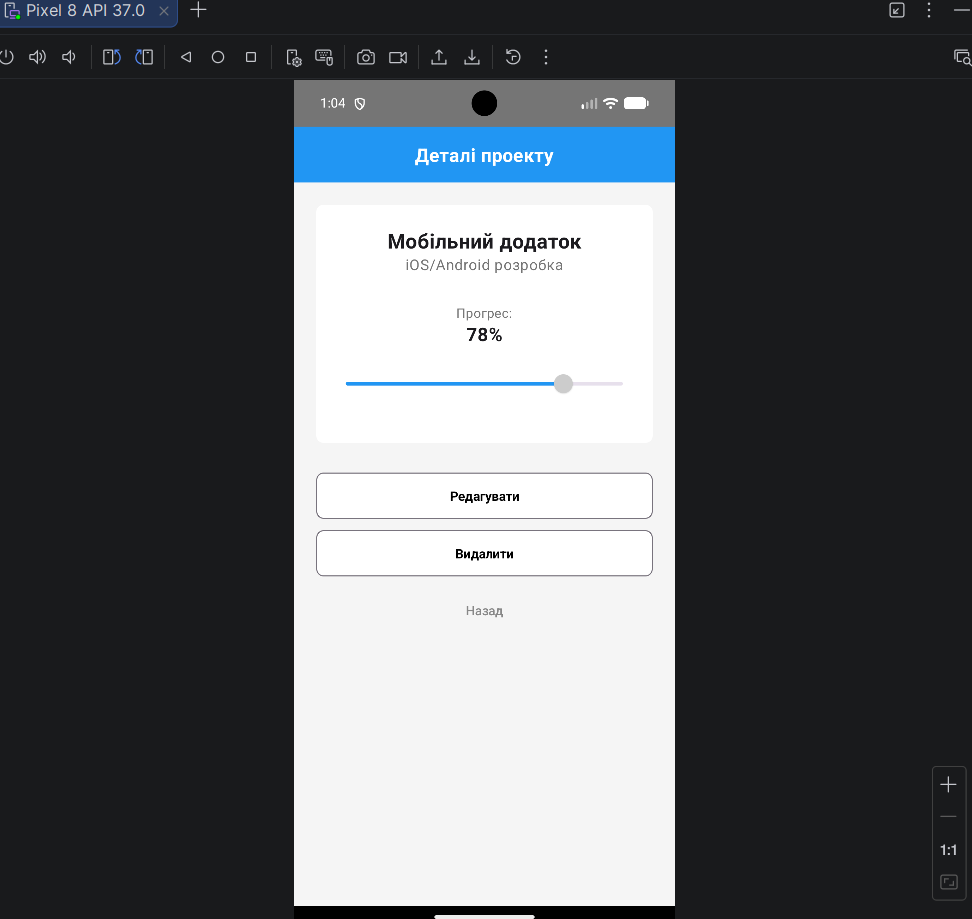
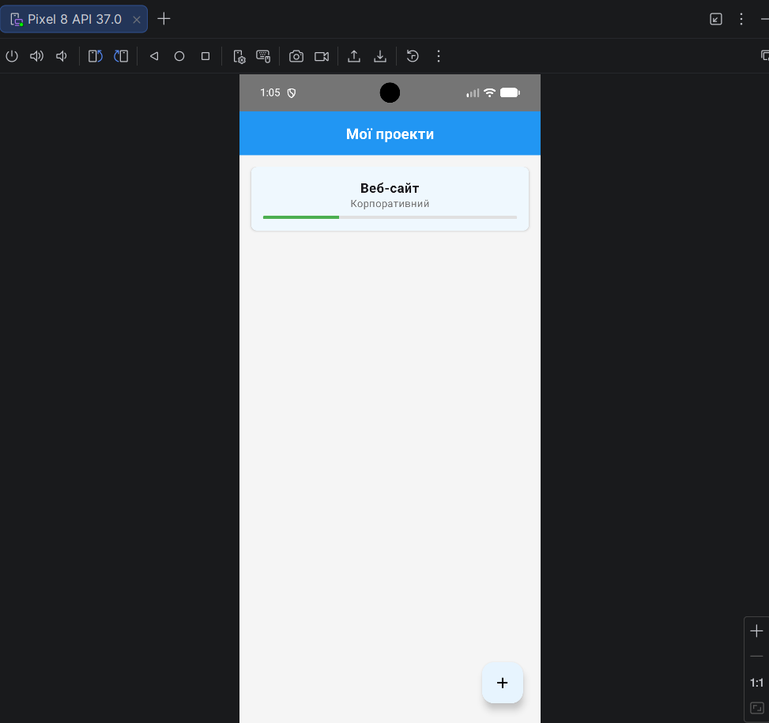

Виконав: Пташников Василь AI-235
1. МЕТА РОБОТИ
Ознайомлення з принципами локального зберігання даних в Android-застосунках за допомогою бібліотеки Room, а також формування навичок побудови багаторівневої структури застосунку з розділенням відповідальності між UI (Jetpack Compose), ViewModel, Repository та локальною базою даних.

2. ЗАВДАННЯ
Доопрацювати застосунок з лабораторної роботи №3 таким чином, щоб усі дані про проекти (назва, опис, прогрес) зберігалися в локальній базі даних Room. Забезпечити збереження даних після повного закриття та повторного запуску застосунку.

3. Результати виконання:

5. ВИСНОВКИ
Під час виконання лабораторної роботи було успішно підключено локальну базу даних Room до Android-проєкту та реалізовано архітектурний шаблон Repository. Створено класи Entity, DAO та RoomDatabase. Бізнес-логіка була відокремлена від збереження даних, а ViewModel переписана для взаємодії з репозиторієм замість колекцій у пам'яті. Завдяки використанню Kotlin Flow інтерфейс Jetpack Compose автоматично оновлюється при змінах у базі даних. Тестування підтвердило повне збереження даних після перезапуску програми.
